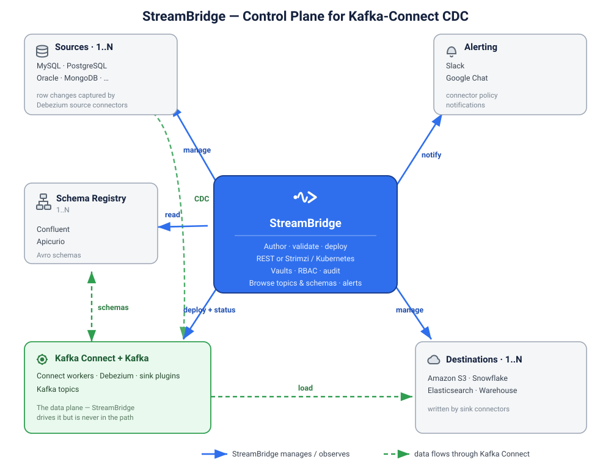

# StreamBridge

StreamBridge is a control plane for Change Data Capture on Apache Kafka Connect. Version 0.1.0.

You keep the cluster. Debezium and the other connectors run in your Kafka Connect workers, on a VM or in Kubernetes. StreamBridge stores the connector config, the secret refs, and where that config is deployed. It does not move the rows, and it does not ship Kafka.



## How a change gets out

1. A database writes its log (Postgres WAL or MySQL binlog).
2. A Connect source, usually Debezium, reads that log and writes a Kafka topic.
3. StreamBridge is the place you validate that connector, deploy it, and read its status.

Deploy has two targets, set on the Kafka Connect connection:

- **Connect.** StreamBridge posts the config to your Kafka Connect REST API.
- **Kubernetes.** StreamBridge creates or updates a Strimzi `KafkaConnector` in the namespace you name. Status, tasks, offsets, and restart still come from the Connect URL.

## What you can do in this release

- **Connectors.** Write a config, validate it against the cluster, and deploy it. One record holds the config, notes, and deploy log.
- **Connections.** Kafka, Kafka Connect, Schema Registry, Slack, and Google Chat.
- **Vaults.** Secret values used by those configs. A masked value already stored is kept on the next save.
- **Plugins.** Built-in connector configs. The Connect image must already contain the plugin class.
- **Kafka topics and Schema Registry.** Browse what the saved connections can see.
- **Alerts.** One policy per connector. The first matching rule pauses, re-triggers, or notifies.

Pipelines and RCA are on screen and marked phase 2. They are not the deploy path. Database credentials belong in a vault and in the connector config.

## What has to be running already

StreamBridge does not install Kafka, Connect, or Strimzi.

- **Python 3.12 or newer.**
- **A database for StreamBridge itself** — SQLite (default, zero‑setup), MySQL, or PostgreSQL.
- **A Kafka Connect cluster you can reach.** For a Kubernetes deploy, a Strimzi operator that watches the same namespace as the `KafkaConnect` cluster.

## Install

```bash
cd streambridge
python3 -m venv .venv
source .venv/bin/activate
pip install -e .
python3 build.py
```

`build.py` assembles the pages under `static/dist/`. Re‑run it after changing an HTML view; CSS/JS are served directly.

## Configure

Settings live in `profile.yaml`.

- **Database.** Set `database.backend` to `sqlite`, `mysql`, or `postgresql`, then fill that backend's host, database, username, and password. Leave a field blank to read it from `STREAMBRIDGE__DATABASE__*` in the environment (or an optional `.env`; see `.env.example`). A value already in the file is kept. SQLite needs nothing.
- **Server.** `server.port` defaults to `5000`.
- **Kafka Connect.** `kafka_connect.url` is only a default — each environment uses the Kafka Connect connection you save in the UI.

### Session key

In team mode StreamBridge signs the login cookie with `auth.secret_key`. The cookie holds the user id. The server accepts it only when the signature matches this key. Personal mode does not ask you to sign in, so the key is unused there.

Leave `auth.secret_key` blank in `profile.yaml`. On first start StreamBridge generates a key and stores it in its own database. Sessions then survive a restart. A value written in the file is used instead of the environment, so do not commit a real key.

To choose the key yourself, generate one and export it. The environment is read only when the yaml field is blank:

```bash
python3 -c "import secrets; print(secrets.token_hex(32))"
export STREAMBRIDGE__AUTH__SECRET_KEY='paste-the-value-here'
```

Changing the key signs every current session out. Users, connectors, and vault data stay. Anyone who can reach a team-mode server and who knows the key can forge a login cookie, so keep the value off Git and off shared hosts.

## Run

```bash
python3 main.py
```

Open `http://127.0.0.1:5000`. On first start StreamBridge creates its tables and loads the built‑in plugins (including `file-source`).

## First run

The first time you open StreamBridge you are guided through setup in the browser — no CLI, no pre‑created admin. You pick how the workspace will be used:

- **Personal.** Just you. No sign‑in — you land straight in the app. Best for solo work and trying things out.
- **Team.** Everyone gets an account, with roles and permissions. You create the first admin here. **Team is permanent:** a team workspace cannot be switched back to personal.

After setup the choice is remembered, so later visits go straight to the app (Personal) or the sign‑in screen (Team).

Prefer the terminal, or locked out of a team workspace? `python3 manage.py admin bootstrap` still creates or recovers an admin.

## Workspace modes and roles

- **Personal** runs with no gate — the single owner can do everything.
- **Team** enforces role‑based access on every page and API call. Permissions deny by default; you only get what a role grants.

Three built‑in roles ship, each inheriting the one before it:

- **Public** — read‑only. Every new account starts here.
- **Operator** — build, validate, deploy, and operate connectors.
- **Admin** — everything, including users, roles, and destructive actions.

An admin assigns roles under **Access Control**. A user with more than one role can switch their active role from the top‑right menu and pick a default.

## Connect it to Kafka

1. Create a **Kafka Connect** connection (Connections → New).
2. Choose **Connect** to deploy via the Kafka Connect REST API, or **Kubernetes** to deploy a Strimzi `KafkaConnector`. Either way, live status, tasks, offsets, and restart are read from the Connect URL.
3. For Kubernetes, set the API host, namespace, Connect cluster name, and a bearer token. The Connect URL is still required.
4. Use **Test** before the first deploy. A Kubernetes `401` means the token was rejected; a `403` means it cannot change connectors in that namespace.
5. Open **Connectors**, author a config, **Validate** it against the cluster, then **Deploy**. Live status and task traces show on the connector's **API** tab.

### Kubernetes API access — how to create it, how to add it

For a **Kubernetes** deploy, StreamBridge writes a Strimzi `KafkaConnector` object through the
cluster's **Kubernetes API**, authenticating with a **ServiceAccount bearer token** (not your
kubeconfig). Create that access once, then add it to a connection.

**1. Create the API access** — a ServiceAccount, a Role that can manage `kafkaconnectors` in the
namespace, a RoleBinding, and a long‑lived token. Apply it in the namespace your `KafkaConnect`
runs in (here, `kafka`):

```bash
# ready-made manifest: sandbox/eks/local-strimzi/streambridge-rbac.yaml (EKS: sandbox/eks/streambridge-eks-rbac.yaml)
kubectl apply -f sandbox/eks/local-strimzi/streambridge-rbac.yaml
```

Then read the two values StreamBridge needs — the **API host** and the **token**:

```bash
# API host (e.g. https://127.0.0.1:53354, or an https://....eks.amazonaws.com endpoint)
kubectl config view --minify -o jsonpath='{.clusters[0].cluster.server}'

# bearer token for the streambridge ServiceAccount
kubectl get secret streambridge-token -n kafka -o jsonpath='{.data.token}' | base64 -d
```

**2. Add it to a connection** — Connections → New → **Kafka Connect**, **Deployment = Kubernetes**:

| Field | Value |
| --- | --- |
| Connect URL | where status/tasks/restart are read (e.g. `http://127.0.0.1:8084`) |
| Kubernetes API host | the API server URL above |
| Namespace | the namespace Strimzi watches (`kafka`) |
| Strimzi cluster | your `KafkaConnect` name (e.g. `my-connect-cluster`) |
| Token | the ServiceAccount token above |
| TLS verification | off for Docker Desktop / self‑signed APIs (a custom CA bundle is not yet supported) |

Click **Test** to confirm StreamBridge can reach both the Kubernetes API and the Connect URL.
Full walkthroughs: [Docker Desktop / Strimzi](sandbox/eks/local-strimzi/README.md) and [Amazon EKS](sandbox/eks/README.md).

## Try it against a real stack (sandbox)

A self‑contained Docker stack (Kafka, Connect, MySQL, Apicurio, Confluent, an S3 mock, and
an S3 web UI) and scripted end‑to‑end tests live under `sandbox/`:

```bash
cd sandbox/ec2/schema_registry/connector_with_schema_registry && docker compose up -d
# then, from the repo root, with StreamBridge running:
.venv/bin/python sandbox/ec2/e2e/e2e_test.py     # deploy MySQL connectors through StreamBridge
.venv/bin/python sandbox/ec2/e2e/e2e_verify.py   # status, topics, schema registries
.venv/bin/python sandbox/ec2/e2e/e2e_cdc.py      # transform shapes + live CDC insert
.venv/bin/python sandbox/ec2/e2e/e2e_s3.py       # S3 sink: CDC topic -> S3 bucket as JSONL
```

It deploys MySQL CDC connectors via StreamBridge against both **Apicurio** and **Confluent**
registries across three transformation levels (none / unwrap / unwrap + router), and an
**S3 sink** that writes a CDC topic to an S3 bucket.

Handy stack URLs: Connect `8083`, Kafka UI `http://localhost:9021`, Confluent SR `8081`,
Apicurio `8080`, **S3 browser `http://localhost:9092`**, S3 mock API `9090`. See
[sandbox/ec2/e2e/README.md](sandbox/ec2/e2e/README.md) for the one‑time Aiven S3 plugin download and details.

## Tests

```bash
python3 -m unittest discover -s tests -t .
```

## Security

Team mode is built deny‑by‑default:

- **Passwords** are hashed with Argon2id — never stored or logged in plaintext.
- **Sessions** use signed, `HttpOnly`, `SameSite=Lax` cookies. Set `auth.cookie_secure: true` when serving over HTTPS.
- **RBAC** is enforced on every page and API route (no permission, no access). The superuser flag exists only for recovery.
- **Mutating requests** are same‑origin checked (CSRF defense).
- **Audit log** records who deployed, paused, or deleted.
- **Secrets** live in vaults and are referenced by token (`{bag.key}`). They are masked in the UI and kept out of logs (configs log key names only, never values). They are stored in the StreamBridge database, so protect that database and wire in an external secrets manager for production.

**Personal mode has no gate by design** — run it on `127.0.0.1` and do not expose the port to a network.

Found a security issue? Please report it privately to the maintainers rather than opening a public issue.

## More docs

- [Installation](docs/INSTALLATION.md)
- [Features](docs/FEATURES.md)
- [End-to-end testing](docs/E2E.md)
- [Sandbox E2E (MySQL + schema registries + S3)](sandbox/ec2/e2e/README.md)
- [Deploy on Kubernetes / Strimzi (local Docker Desktop)](sandbox/eks/local-strimzi/README.md)
- [Deploy to Amazon EKS](sandbox/eks/README.md)

## License

StreamBridge is **proprietary** — Copyright © 2026 StreamBridge, all rights reserved. No permission is granted to copy, modify, merge, publish, distribute, sublicense, or sell the software except by written agreement with StreamBridge.

Third‑party components it runs against keep their own licenses — Apache Kafka, Kafka Connect, Debezium, Strimzi, and the Python packages listed in `pyproject.toml`. See [LICENSE](LICENSE) for the full text.
